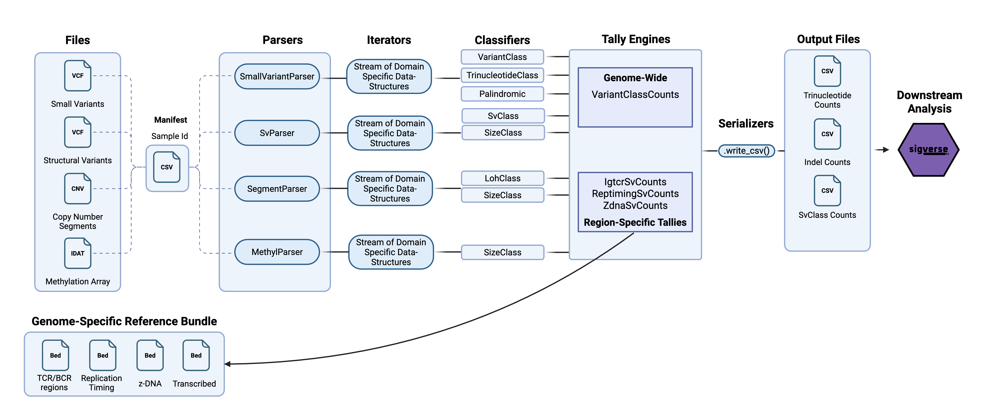

> \[!WARNING\]  
> This package is in early development and not ready for use

ScarScape extracts the landscape of tumorigenic scars from cancer omics data. For each tumour, it processes common biological data types, classifying each instance of omic damage by its affected loci, sequence context, clustering pattern, and other contextual features. It then reports the frequency of these distinct damage types. By carefully defining how mutations are classified and counted, ScarScape aims to clearly reveal the active mechanisms driving tumorigenesis.

---


## Installation

Refer to the latest release for installation instructions.

The development version can be installed using cargo

```
cargo install --git https://github.com/CCICB/scarscape  
```

---

## Quick Start

Prepare a [manifest](testfiles/manifest.csv) CSV with the following columns:

- **sample:** Unique sample identifier (must match SNV VCF identifiers)
- **snv:** Path to SNV/INDEL VCF (bgzipped and indexed via `tabix -p vcf path/to/vcf.gz`)
- **sv:** Path to structural variant VCF (one entry per breakend)
- **cnv:** Path to copy number TSV (must include: `chromosome`, `start` (1-based), `end` (inclusive), `copyNumber`, `minorAlleleCopyNumber`)

Note: Each sample must have at least one file type specified (snv, sv, or cnv).

```{bash}
scarseek --manifest <path_to_manifest.csv> --genome hg38 --fasta /path/to/hg38.fasta
```

*Note* genome `--genome` argument (hg38/hg19) is used to make some assumptions about regions that hold true for all common hg38/hg19 reference genomes, whereas `--fasta` lets users specify the actual fasta file required for sequence lookup (used in trinucleotide context counts). 

---

## Metrics

The metrics captured by ScarScape are carefully chosen to reflect diverse tumorigenic mechanisms, so that downstream analyses stand the best chance of mapping these features back to their aetiological processes. 


### Endogenous Rearrangement Hyperactivity

To characterise B & T cell-derived tumors, which may be driven by endogenous mutagenic enzymes (e.g., RAG for VDJ rearrangement, APOBEC for hypermutation), ScarScape quantifies:

- **SV counts in VDJ regions** to (hopefully) reveal bias towards IG loci in B cell tumours and TCR loci in T cells)
- **Somatic hypermutation** of IG/TCR loci (a B cells-specific process)
- **Total SV mutation count** for normalisation and detection of SV hypermutated samples.

## Output


### SV features

Each sample produces an `<sample>.svcounts.csv` file with the following columns:

| Column | Description                   |
| ------ | ----------------------------- |
| sample | Sample identifier             |
| total  | Total SV count (pass + fail)  |
| pass   | Count of pass SVs             |
| fail   | Count of fail SVs             |
| igtcr  | PASS SVs in IG or TCR regions |
| igh    | PASS SVs in IGH loci (BCR)    |
| igk    | PASS SVs in IGK loci (BCR)    |
| igl    | PASS SVs in IGL loci (BCR)    |
| tra    | PASS SVs in TRA loci (TCR)    |
| trb    | PASS SVs in TRB loci (TCR)    |
| trd    | PASS SVs in TRD loci (TCR)    |
| trg    | PASS SVs in TRG loci (TCR)    |


### Small variant features
Each sample produces an `<sample>.smallvariantcounts.csv` file with the following columns:

| Column               | Description                                                                   |
| -------------------- | ----------------------------------------------------------------------------- |
| sample               | Sample identifier                                                             |
| small_variants       | Total PASS SNVs, Doublets & Indels                                            |
| snvs                 | Count of pass SNVs                                                            |
| indels               | Count of pass Insertions and Deletions                                        |
| doublets             | Count of pass doublets (pairs of neighbouring bases both mutated), non-phased |
| igtcr_small_variants | Count of pass variants in IG or TCR regions                                   |
| igh_small_variants   | PASS SNVs in IGH loci (BCR)                                                   |
| igk_small_variants   | PASS SNVs in IGK loci (BCR)                                                   |
| igl_small_variants   | PASS SNVs in IGL loci (BCR)                                                   |
| tra_small_variants   | PASS SNVs in TRA loci (TCR)                                                   |
| trb_small_variants   | PASS SNVs in TRB loci (TCR)                                                   |
| trd_small_variants   | PASS SNVs in TRD loci (TCR)                                                   |
| trg_small_variants   | PASS SNVs in TRG loci (TCR)                                                   |

Each sample produces an `<sample>.sbs96.csv` file with the following columns:

Standard SBS96 feature counts 


### Architecture



